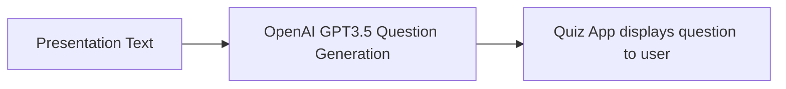

# Introduction_to_AI_Streamlit_Quiz_App

This project aims to build a quiz application using streamlit for the session: `Introduction to AI`

**Topics**

1. [Overview](#overview)
2. [Goals](#goals)
3. [Scope and Context](#scope-and-context)
4. [System Design](#system-design)
5. [Alternatives Considered](#alternatives-considered)
6. [Learning Logs](#learning-logs)
7. [Resources](#resources)

---

## Overview

The design doc for the Streamlit web app focuses on developing a robust and interactive platform for the
"Introduction to AI" talk, with the overarching objective of evaluating participants' knowledge of AI through
a didactic quiz.

The app aims to provide an engaging and user-friendly experience by implementing various key features.
These features include:
- A well-designed user interface for the quiz
- Dynamic question generation,
- Immediate feedback on answers,
- A scoring system.

The app will utilize Streamlit's easy-to-use framework to seamlessly integrate the quiz functionality and
AI evaluation, ultimately enhancing the learning experience for participants.

## Goals

- Personalize learning experience for participants.
- Evaluating participants knowledge of the topic presented.
- Provide an live example of an application leveraging AI.

## Scope and Context

This project encompasses the development of a robust and interactive Streamlit web app for
the "Introduction to AI" talk.

The app's primary objective is to evaluate participants' knowledge of AI through a didactic quiz.
By leveraging Streamlit's framework, the app aims to create an engaging and user-friendly experience
for the participants.

## System Design

## Alternatives Considered

We could use `gradio` as an alternative to streamlit.
But streamlit offers a better hosting service.

## Learning Logs

| Date | Learning |
|------|----------|
|      |          |

## Resources
