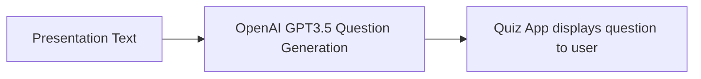

# ¿Qué es AI y hacia donde vamos?

Este repositorio contiene el contenido relacionado con la charla:

`¿Qué es AI y hacia donde vamos?`

Por: Kevin Knights

**Contenido**

1. [Visión general](#vision-general)
2. [Objetivos](#objetivos)
3. [Alcance y contexto](#alcance-y-contexto)
4. [Diseño del sistema](#diseño-del-sistema)
5. [Alternativas consideradas](#alternativas-consideradas)
6. [Registros de aprendizaje](#registros-de-aprendizaje)
7. [Recursos](#recursos)

---

## Vision General

El documento de diseño para la aplicación web de Streamlit se centra en desarrollar una plataforma robusta e interactiva para la charla "Introducción a la IA", con el objetivo principal de evaluar el conocimiento de los participantes sobre IA a través de un cuestionario didáctico.

La aplicación tiene como objetivo proporcionar una experiencia atractiva y fácil de usar mediante la implementación de varias características clave. Estas características incluyen:

Una interfaz de usuario bien diseñada para el cuestionario.
Generación dinámica de preguntas.
Retroalimentación inmediata sobre las respuestas.
Un sistema de puntuación.
La aplicación utilizará el framework fácil de usar de Streamlit para integrar de manera eficiente la funcionalidad del cuestionario y la evaluación de la IA, mejorando en última instancia la experiencia de aprendizaje de los participantes.

## Objetivos

- Personalizar la experiencia de aprendizaje para los participantes.
- Evaluar el conocimiento de los participantes sobre el tema presentado.
- Proporcionar un ejemplo en vivo de una aplicación que aproveche la IA.

## Alcance y Contexto

Este proyecto abarca el desarrollo de una aplicación web robusta e interactiva de Streamlit para la charla "Introducción a la IA".

El objetivo principal de la aplicación es evaluar el conocimiento de los participantes sobre IA a través de un cuestionario didáctico. Al aprovechar el framework de Streamlit, la aplicación tiene como objetivo crear una experiencia atractiva y fácil de usar para los participantes.

## Diseño del sistema

## Alternativas consideradas

Podríamos utilizar gradio como una alternativa a Streamlit. Sin embargo, Streamlit ofrece un mejor servicio de alojamiento.

## Registros de aprendizaje

| Date | Learning |
|------|----------|
|      |          |

## Recursos
